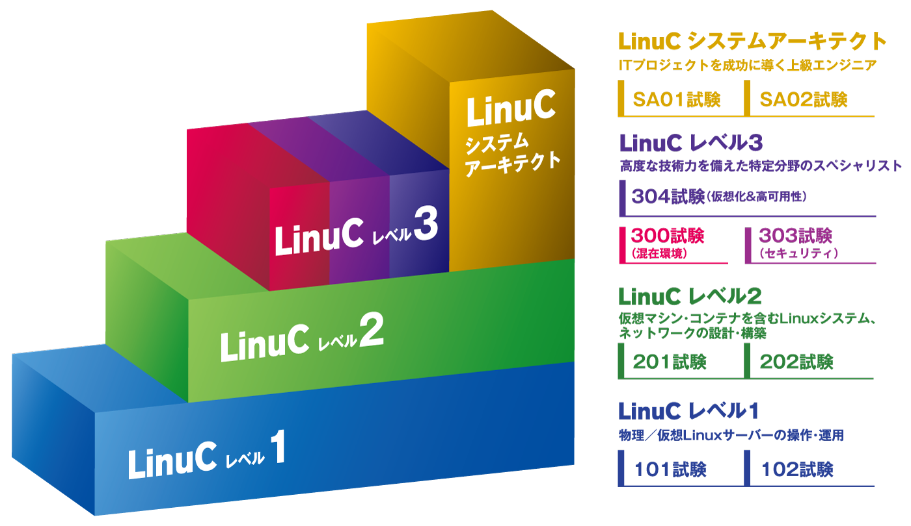

# まえがき {.unlisted .unnumbered}

このたび、特定非営利活動法人エルピーアイジャパンは、Linux技術者教育に利用していただくことを目的とした教材、「Linuxシステム管理標準教科書」をインターネット上にて公開し、提供することとなりました。

この「Linuxシステム管理標準教科書」は、既に公開し、多くの教育機関や学習者に活用されている「Linux標準教科書」「Linuxサーバー構築標準教科書」の続編として作成されました。本教科書では、Linuxを扱うシステム管理者が知っておきたい運用管理の基本を、実習を交えて理解することを目的にしています。2024年から始まった全面改訂プロジェクトに従い、本教科書も最新のLinuxディストリビューションに対応する形で2015年にリリースされたバージョン1の改訂を行いました。

公開にあたっては、「Linuxシステム管理標準教科書」に添付されたライセンス（クリエイティブ・コモンズ・ライセンス）の下に公開されています。

本教科書の最新情報は以下のWebページをご参照ください。

```
https://linuc.org/textbooks/admin/
```

## 本教科書の目的 {.unlisted .unnumbered}
本教科書の目的は、実習を通してLinuC試験に含まれるLinuxシステムの運用管理に関わる知識を学習することにあります。実際にユーザーやファイル、ディレクトリを作成し、Webサーバーなどを動作させながら、運用管理に関する基本的な技術を修得できます。

### 本教科書でカバーされない範囲 {.unlisted .unnumbered}
本教科書は実務で必要となるLinuxシステム管理の実践的なスキルに絞って解説しており、LinuCレベル1、レベル2の試験範囲に含まれるすべてのシステム管理に関わる事項について解説していません。本教科書で触れられていない範囲については、別途調べてみて理解を深めてください。

## 想定している実習環境 {.unlisted .unnumbered}
本教科書での実習環境として、以下の環境を想定しています。

### 学習者 {.unlisted .unnumbered}
学習者は1名で実習を進めることができます。

### 実習環境 {.unlisted .unnumbered}
「Linux標準教科書」「Linuxサーバー構築標準教科書」同様、仮想マシンを使った実習環境を想定しています。
実習環境の準備については、両教科書を参照して行ってください。

### 本教科書で使用しているソフトウェア {.unlisted .unnumbered}
仮想マシンはVirtualBox for Windowsを使用しています。使い慣れているソフトウェアがあれば、そちらを使っても構いません。

Linuxディストリビューションは、AlmaLinux 9.6（x86 64ビット）を使用しています。

### 本教科書が想定しているネットワーク
ネットワークは、インターネットに接続できることを前提にしています。

インターネットに接続できない場合、ソフトウェアの追加インストールなどいくつかの実習が行えない場合があります。その場合の対処方法については5章で解説しています。

## 全体の流れ {.unlisted .unnumbered}
本教科書では、以下の通りに実習を進めます。

### 第1章 ユーザーとグループの管理 {.unlisted .unnumbered}
Linuxシステムの基本であるユーザーとグループの管理について基本をしっかりと確認します。セキュリティにも関わるため、SSHによるリモートログインとrootユーザーについても解説します。

### 第2章 ネットワークの管理 {.unlisted .unnumbered}
ネットワークの管理について解説します。セキュリティとしてパケットフィルタリングについても解説します。

### 第3章 サービスの管理 {.unlisted .unnumbered}
systemdのサービス管理について解説します。また、NTPによる時刻設定についても触れています。

### 第4章 ファイルシステムの管理 {.unlisted .unnumbered}
ファイルシステムのアクセス権管理について解説します。アクセス制御の観点から、SELinuxについても解説します。ファイルシステムの基盤であるストレージ管理、LVM（Logical Volume Manager）も解説します。

### 第5章 システムのメンテナンス {.unlisted .unnumbered}
システムのメンテナンスの基本であるパッケージ管理について解説します。また、システム監視についても解説します。

### 第6章 トラブルシューティング {.unlisted .unnumbered}
基本的なトラブルシューティングの手法について解説します。

後の章では、それよりも前の章での実習を前提に実習が進められている場合があります。実習を省略した場合、実習結果が異なる場合があります。
また、ファイアーウォールやSELinuxなどセキュリティに関する設定について理解ができていることを想定しています。正常に実習が行えない場合には、「第6章 トラブルシューティング」の内容を参考にしてみてください。

## 利用上の注意 {.unlisted .unnumbered}
本教科書は、Markdown形式で執筆を行い、Pandocを使用してPDF形式およびEPUB形式に変換しています。変換ツールの使用上、以下のような問題が判明しています。可能な限り対応していますが、技術的な制約のため問題が残ってしまっている点に注意してご利用ください。

### -（ハイフンが）2つ続く場合の問題 {.unlisted .unnumbered}
本文中で-が2つ続くと、長い--になってしまう問題が確認されています。Webブラウザ上での取り扱いでは回避方法が確認されていますが、Pandocによる変換では正常に動作しないため、コマンドのオプションやパーミッション表記などで-を2つ記述できません。この問題を回避するため、-と-の間にスペースを入力しています。見た目が少しおかしくなっていますが、この回避方法によるものです。

### コマンド実行例などで空白が入ってしまう問題 {.unlisted .unnumbered}
コマンド実行例やURLなどで空白が入ってしまう問題が確認されています。-や/などの記号が含まれているとその前に空白が入るため、コピー＆ペーストで実行しようとすると正常に実行できない、URLをクリックしてWebブラウザにアクセスできないなどの問題が発生します。発生する理由が不明のため、問題を解決、回避できていません。このような問題が起きた場合には、コピー＆ペーストする際に手動で空白を取り除いてください。

## 執筆者・制作者紹介 {.unlisted .unnumbered}
本教科書は、オープンなプロジェクト形式で開発を行っています。企画段階から意見交換を行い、事前の技術的な調査、執筆、レビューなどをプロジェクトのメンバーで分担して行っています。

### 宮原 徹（バージョン2全体執筆担当） {.unlisted .unnumbered}
本教科書は、Linux/オープンソースソフトウェアをこれから勉強する皆さんと、熱心に指導に当たられている先生方の一助になればと思い、作成いたしました。バージョン2の改訂にあたっては、新しいディストリビューションへの対応だけでなく、より分かりやすい実習になるように調整を行ってみました。また、バージョン1の記載から実務で不要と思われる項目については思い切って削除し、見通しのよい構成に変更してみました。このレベルでは技術が複合的になるため、一本道で解説するのが難しい面があります。一度通しで目を通した後、2回、3回と実際に手を動かしてみることで技術相互の関係性が理解できるでしょう。

### バージョン1執筆者 {.unlisted .unnumbered}
バージョンアップに伴う変更がなかった解説は、以下の方々の執筆によるものです。

- 平 愛美（バージョン1：1章〜3章執筆担当）
- 面 和毅（バージョン1：4章〜6章執筆担当）

### バージョン2の開発にご協力をいただいた方々（50音順） {.unlisted .unnumbered}
- 秋庭 雅明（データプロセス株式会社）
- 榎本 浩義（弓削商船高等専門学校）
- 上堂薗 健（DaaS合同会社）
- 河原木 忠司
- 島ノ江励（フューチャー株式会社）
- 竹本 季史（インターノウス株式会社）
- 平川 雄一（株式会社テクノプロ　テクノプロ・エンジニアリング社）
- 福永 昭臣（株式会社ボールド）
- 宮本 清正（日本アイ・ビー・エム株式会社）
- 山口昌幸（NECソリューションイノベータ株式会社）

## 著作権 {.unlisted .unnumbered}
本教科書の著作権は特定非営利活動法人エルピーアイジャパンに帰属します。

Copyright©️ LPI-Japan. All Rights Reserved.

## 使用に関する権利 {.unlisted .unnumbered}
本教科書は、クリエイティブ・コモンズ・ライセンスの「表示 - 非営利 - 改変禁止 4.0 国際 (CC BY-NC-ND 4.0) 」によってライセンスされています。

{width=200px}


### 表示 {.unlisted .unnumbered}
本教科書は、特定非営利活動法人エルピーアイジャパンに著作権が帰属するものであることを表示してください。

### 非営利 {.unlisted .unnumbered}
本教科書は、非営利目的で教材として自由に利用することができます。

商業上の利得や金銭的報酬を主な目的とした営利目的での利用は、特定非営利活動法人エルピーアイジャパンによる許諾が必要です。ただし、本教科書を利用した教育において、本教科書自体の対価を請求しない場合は、営利目的の教育であっても基本的に使用できます。
その場合も含め、LPI-Japan 事務局までお気軽にお問い合わせください。

＊営利目的の利用とは以下のとおり規定しております。
営利企業または非営利団体において、商業上の利得や金銭的報酬を目的に本教科書の印刷実費以上の対価を受講生に請求して本教科書の複製を用いた研修や講義を行うこと。

### 改変禁止 {.unlisted .unnumbered}
本教科書は、改変せず使用してください。本教科書に対する改変は、特定非営利活動法人エルピーアイジャパンまたは特定非営利活動法人エルピーアイジャパンが認める団体により行われています。

## フィードバック {.unlisted .unnumbered}
フィードバックは誰でも参加できる Slack で受け付けていますので、積極的にご参加ください。Slack参加の詳細は以下の本教科書のWebページを参照してください。

```
https://linuc.org/textbooks/admin/
```

{width=25%}

## 本教科書の使用に関するお問合せ先 {.unlisted .unnumbered}
特定非営利活動法人エルピーアイジャパン（LPI-Japan）事務局  
〒100-0011 東京都千代田区内幸町2-1-1 飯野ビルディング9階  
TEL：03-6205-7025  
E-Mail：info@lpi.or.jp

## Linux技術者認定「LinuC（リナック）」のご紹介 {.unlisted .unnumbered}
Linux技術者認定「LinuC（リナック）」とは、クラウド／DX時代のITエンジニアに求められるシステム構築から運用管理に必要なスキルを証明できる技術者認定です。アーキテクチャ設計からシステム構築、運用管理までの技術領域を広くカバーしており、４つのレベルの認定取得を通じて一歩ずつ確実に求められるスキルを習得し、それを証明することができます。

LinuCの出題範囲策定や試験開発は、実際に現場で活躍しているハイレベルなITエンジニアが参加するコミュニティによって行われています。そのため、グローバルで業界標準として利用されている技術領域をカバーし、システム開発や運用管理の現場で本当に必要とされる知識や実践的なスキルを問う内容になっています。その結果として従来型のLinux領域にとどまった技術認定とは異なり、国内・海外を問わず活躍を目指すITエンジニアにとっても十分役立つ技術者認定となりました。

{width=50%}

### LinuCレベル１ {.unlisted .unnumbered}
コンピュータシステムを理解し、仮想環境を含むLinuxシステムの基本操作とシステム管理が行える即戦力エンジニアの証明（ITSSレベル1）

### LinuCレベル２ {.unlisted .unnumbered}
仮想環境を含むLinuxのシステム設計・ネットワーク構築において、アーキテクチャに基づいた設計・導入・保守・問題解決ができるエンジニアの証明（ITSSレベル2）

### LinuCレベル３ {.unlisted .unnumbered}
異種混在環境の運用スキル、Linuxベースのセキュアなシステム設計・構築スキル、大規模な仮想化システムや高可用性システムの構築スキルといったスペシャリストの証明（ITSSレベル3）

### LinuCシステムアーキテクト {.unlisted .unnumbered}
オンプレ／クラウド、物理／仮想化を含むシステムのライフサイクル全体を俯瞰して最適なアーキテクチャを設計・構築ができる上級エンジニアの証明（ITSSレベル4相当のスキルレベル）

LinuCの詳細については、以下のWebサイトを参照してください。

```
https://linuc.org/about/01.html
```

{width=25%}

\pagebreak


