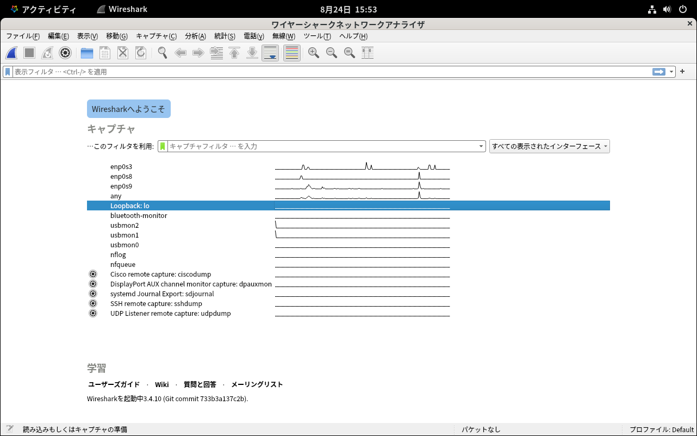
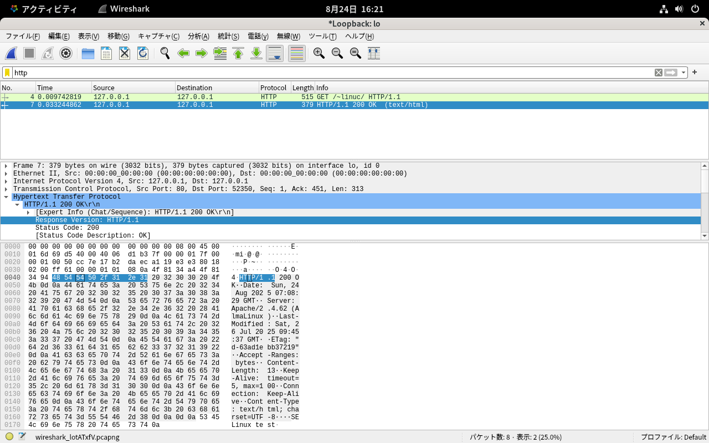

# トラブルシューティング

## トラブルシューティングの手法
サーバーに接続できないなどネットワークに起因する問題が発生した場合、以下のような手順で原因の調査を行います。

1. ログの確認
1. pingコマンドによるIP通信の確認
1. 接続経路やポートの状況の確認
1. 通信内容の確認

## ログ管理
システム障害の問題解決をはかるトラブルシューティングを行う場合に、もっとも有益な情報源がログです。

ログには、OSが出力するログ、アプリケーションが出力するログなど多くの種類が存在します。

ここでは、代表的なログの種類と確認方法、設定方法などを解説します。

### ログの種類
AlmaLinuxでは、ログファイルは/var/logディレクトリ以下に格納されています。

以下は代表的なログファイルです。

|ファイル名|内容|
|-------|-------|
|messages|サービス起動時の出力など一般的なログ|
|secure|認証、セキュリティ関係のログ|
|maillog|メール間連のログ|

また、systemdが記録するjournaldのログが存在します。こちらは別途解説します。

### ログの確認
サーバーのログにサービス起動時、または動作時のエラーログが記録されていないかを確認します。また、クライアント側にもエラーログが記録されていないかを確認します。

* 一般的なトラブルであれば、まずは/var/log/messagesを確認します。
* 認証関係やアクセス制限に関係するトラブルは/var/log/secureを確認します。
* メール関係であれば/var/log/maillogを確認します。
* Webサーバーであれば/var/log/httpd/error_logなどを確認します。

### dmesgに記録されるログ
dmesgコマンドは「display message」の略で、Linuxカーネルがメッセージを出力するリングバッファ（循環バッファ）の内容を表示します。このリングバッファは一定のサイズ内で循環するようになっており、古いログは消えていきます。
dmesgコマンドを用いることにより、システム起動時に出力されるカーネルメッセージの確認ができます。カーネルが正しくハードウェアを認識しているかどうかを確認する場合などに参照します。

```
$ dmesg
[    0.000000] Linux version 5.14.0-570.26.1.el9_6.x86_64 (mockbuild@x64-builder03.almalinux.org) (gcc (GCC) 11.5.0 20240719 (Red Hat 11.5.0-5), GNU ld version 2.35.2-63.el9) #1 SMP PREEMPT_DYNAMIC Wed Jul 16 09:12:04 EDT 2025
[    0.000000] The list of certified hardware and cloud instances for Red Hat Enterprise Linux 9 can be viewed at the Red Hat Ecosystem Catalog, https://catalog.redhat.com.
[    0.000000] Command line: BOOT_IMAGE=(hd0,gpt2)/vmlinuz-5.14.0-570.26.1.el9_6.x86_64 root=/dev/mapper/almalinux_vbox-root ro crashkernel=1G-4G:192M,4G-64G:256M,64G-:512M resume=/dev/mapper/almalinux_vbox-swap rd.lvm.lv=almalinux_vbox/root rd.lvm.lv=almalinux_vbox/swap rhgb quiet
[    0.000000] [Firmware Bug]: TSC doesn't count with P0 frequency!
[    0.000000] BIOS-provided physical RAM map:
（略）
```

### syslogについて
syslogは、カーネルやプログラムなどから出力されるログをまとめて記録する仕組みです。syslogを使うことで、各プログラムは独自にログを記録する仕組みを開発する必要が無くなります。また、syslogサーバーをネットワーク上で動作させることで、複数のホストからのログをまとめて記録することで、ログを一元管理することもできます。
AlmaLinuxでは、syslogサーバーとしてrsyslogが使用できます。

rsyslogは、従来のsyslogデーモン（syslogd）に置き換わる、マルチスレッドのsyslogデーモンです。rsyslog（Reliable syslog）という名前からも分かる通り、高い信頼性を実現するように開発されています。そのため、ログの転送にTCPを使用したり、データベースへのログ保存、暗号化したログの転送なども行うことができます。基本的な設定については、従来のsyslogdと互換性があります。

### ファシリティとプライオリティ
カーネルやプログラムが出力するsyslogメッセージには、「ファシリティ」（facility）と「プライオリティ」（priority）と呼ばれる値が設定されています。

ファシリティは、何がそのログメッセージを生成したのかを指定します。たとえば、カーネルやメールといった値が指定されます。

また、プライオリティはメッセージの重要性を指定します。たとえば、単なる情報、非常に危険な状態などといった値が指定されます。

ファシリティには、以下の種類があります。

|ファシリティ|意味|
|-------|-------|
|auth|セキュリティ・認証関連（login、su など）|
|authpriv|セキュリティ・認証関連（プライベート）|
|cron|cronやatのログ|
|daemon|一般的なデーモン（サーバープログラム）関連|
|kern|カーネル関連|
|lpr|プリンタ関連|
|mail|メール関連|
|news|NetNews関連|
|security|authと同じ|
|syslog|syslogd自身のログ|
|user|ユーザアプリケーションのログ|
|uucp|uucp転送を行うプログラムのログ|
|local0からlocal7|独自のプログラムで利用可能なfacility|

プライオリティには、以下の種類があります。

|プライオリティ|意味|
|-------|-------|
|debug|デバッグ用メッセージ|
|info|一般的な情報メッセージ|
|notice|通知メッセージ|
|warning|警告メッセージ|
|warn|warningと同じ|
|err|一般的なエラーメッセージ|
|error|errと同じ|
|crit|ハード障害などの危険なエラーメッセージ|
|alert|システム破損などの緊急事態|
|emerg|非常に危険な状態|
|panic|emergと同じ|
|none|ファシリティを無効にする|

### syslogサーバーの設定
syslogサーバーの設定ファイルである/etc/rsyslog.confには、受け取ったログメッセージをファシリティとプライオリティの組み合わせでどのファイルに出力するかの設定が記述されています。

記述は以下の形式となります。

```
ファシリティ.プライオリティ	アクション
```

syslogサーバーの設定ファイル中で、複数のファシリティを指定したい場合には、「,」（コンマ）で区切ります。たとえば、/var/log/messagesには様々なファシリティからのログが記録されるように設定されています。この設定は、すべてのファシリティのinfoプライオリティ以上のログをすべて/var/log/messagesに出力するようにしています。ただし、mail、authpriv、cronの3つのファシリティにはnoneプライオリティが指定されているため、対象からは除外されています。

```
*.info;mail.none;authpriv.none;cron.none                /var/log/messages
```

除外された各ファシリティの出力は、以下のように別途指定されています。

mailファシリティのログは、メモリ上にある程度バッファリングした上でログファイルに書き込むように「-（ハイフン）」を指定しています。メールサーバーは一度に大量のログを書き込むことが多いからです。

```
authpriv.*						/var/log/secure
mail.*							-/var/log/maillog
cron.*							/var/log/cron
```

### プライオリティの動作
syslog設定ファイル中でプライオリティを指定すると、そのプライオリティ以上の重要度のプライオリティがすべて当てはまります。たとえば、以下のように設定したとします。

```
mail.warning
```

mailファシリティからのwarning以上（err、crit、alert、emerg）のすべてのプライオリティが当てはまります。

特定のプライオリティのみ指定したい場合には、「=プライオリティ」と指定します。

```
mail.=warning
```

この指定はmailファシリティのプライオリティがwarningのメッセージのみが当てはまります。

### アクションの設定
ファシリティとプライオリティを記述した右側に、該当するログをどうするかを指定するアクションを記述します。

主なアクションは、以下の表のとおりです。

#### ファイル名
ログをファイルに書き込む。

#### -ファイル名
ログをファイルに書き込む際にバッファリングする。書き込み性能が向上するが、書き込まれていないデータがある時にシステム障害が発生するとログが失われる。

#### ¥プログラム
ログメッセージをプログラムに引き渡す。

#### *
すべてのユーザのコンソールにメッセージを表示する。今後、使用できなくなる可能性があります。

#### :omusrmsg:*
*同様にすべてのユーザのコンソールにメッセージを表示する。今後はこちらを使用することが推奨されています。

#### @ホスト名（あるいはIPアドレス）
UDPでsyslogサーバーにログメッセージを送信する。

#### @@ホスト名（あるいはIPアドレス）
TCPでsyslogサーバーにログメッセージを送信する。

### カーネルログのsyslog出力設定
デフォルトの設定ではコメントアウトされて無効になっているカーネルからのログ出力の設定を有効にします。カーネルのログは、たとえばnftablesによるパケットフィルタリングのようなカーネルの機能がログを出力します。

firewalldの設定を変更して、拒否した通信をすべてログ出力するように変更します。

```
$ sudo firewall-cmd --get-log-denied
off
$ sudo firewall-cmd --set-log-denied=all
success
$ sudo firewall-cmd --get-log-denied
all
$ sudo firewall-cmd --reload
success
```

この状態では、カーネルからのログ出力はすべて/var/log/messagesに記録されます。/etc/rsyslog.confを編集し、ファシリティがkern、プライオリティが全てのメッセージを/var/log/kern.logに出力する設定を追加します。

```
$ sudo vi /etc/rsyslog.conf

# Log all kernel messages to the console.
# Logging much else clutters up the screen.
#kern.*                                                 /dev/console
kern.*                                                 /var/log/kern.log
```

rsyslogサービスを再起動して、新しい設定を読み込ませます。

```
$ sudo systemctl restart rsyslog
```

### firewalldのログ設定変更
firewalldはカーネルのnftablesを使用しているため、そのログはカーネルのログとして出力されます。デフォルトではfirewalldのログ出力は無効になっているので、有効にします。

設定の状態を確認するには、firewall-cmdコマンドに- -get-log-deniedオプションをつけて実行します。

```
$ sudo firewall-cmd --get-log-denied
off
```

デフォルトではoffの状態ですが、これを- -set-log-deniedオプションでallに設定し、すべてのパケットのログを取得します。

```
$ sudo firewall-cmd --set-log-denied=all
success
$ sudo firewall-cmd --get-log-denied
all
```

### firewalldのログ取得
ホストOS上で動作するWebブラウザなど外部のクライアントから、設定を行ったホストに対して、firewalldで許可されていないポート443番にWebブラウザ等でアクセスしてみます。

firewalldの設定は以下の通りです。

```
$ sudo firewall-cmd --list-service
cockpit dhcpv6-client http ssh
```

Webブラウザに入力するアドレスは、プロトコルとしてhttpsで指定してポート番号443番にアクセスするようにします。

```
https://ホストのIPアドレス（192.168.56.101）
```

/var/log/kern.logにポート番号443番に対する通信を拒否した旨のログが出力されます。DPTが宛先のポートです。

```
$ sudo tail /var/log/kern.log 
Jul 19 19:21:07 vbox kernel: filter_IN_public_REJECT: IN=enp0s8 OUT= MAC=08:00:27:40:b7:96:d0:11:e5:1a:ce:3b:08:00 SRC=192.168.11.115 DST=192.168.56.101 LEN=64 TOS=0x00 PREC=0x00 TTL=64 ID=0 DF PROTO=TCP SPT=62291 DPT=443 WINDOW=65535 RES=0x00 CWR ECE SYN URGP=0
```

### リモートホストのログをUDPで受け取る
syslogサーバーとしてリモートホストのログを受け取るための設定を行います。syslogのメッセージの送受信は、通常UDPで行われます。

設定ファイル/etc/rsyslog.conf内にある以下の2行から、行頭のコメントアウトを削除して設定を有効にします。

module(load="imudp")は、UDP用のプロトコルモジュールのロードを設定しています。input(type="imudp" port="514")は、UDPでログメッセージを受け取るポート番号を514番として指定しています。

```
$ sudo vi /etc/rsyslog.conf
```

```
（略）
# Provides UDP syslog reception
module(load="imudp") # needs to be done just once
input(type="imudp" port="514")
```

rsyslogサービスを再起動します。rsyslogdがUDPのポート番号514番で待ち受けるようになります。

```
$ sudo systemctl restart rsyslog
$ ss -uln | grep 514
UNCONN 0      0                                0.0.0.0:514        0.0.0.0:*
UNCONN 0      0                                   [::]:514           [::]:*
```

設定後、firewalldの設定を変更し、外部からのUDPのポート番号514番へのパケットを許可するように設定を変更する必要があります。設定については後述します。

### リモートホストのログをTCPで受け取る
ログメッセージの送受信にTCPを使用することにより、UDPで発生していたログの取りこぼしを防ぐことができます。UDPはセッションレスなプロトコルのため、送受信に失敗した時に再送信する仕組みが無いためです。

ただし、TCPはプロトコルの性質上UDPよりも処理が重くなってしまうため、大量のログが送信されてくる環境では逆にボトルネックになってしまい、syslogサーバー側が高負荷で処理が滞ってしまう可能性があります。

そのため、TCPを使ったログメッセージの送受信は、ログの量がそれほど多くなくログ記録の信頼性が必要な場合に設定します。もし、大量のログが送信されてくる場合には、syslogサーバーを複数用意するか、UDPを使う必要があります。

設定ファイル/etc/rsyslog.conf内にある以下の2行から、行頭のコメントアウトを削除して設定を有効にします。

module(load="imtcp")は、TCP用のプロトコルモジュールのロードを設定しています。input(type="imtcp" port="514")は、TCPでログメッセージを受け取るポート番号を514番として指定しています。

```
$ sudo vi /etc/rsyslog.conf
```

```
（略）
# Provides TCP syslog reception
module(load="imtcp") # needs to be done just once
input(type="imtcp" port="514")
```

rsyslogサービスを再起動します。rsyslogdがTCPのポート番号514番で待ち受けるようになります。

```
$ sudo systemctl restart rsyslog
$ ss -tln | grep 514
LISTEN 0      25           0.0.0.0:514       0.0.0.0:*
LISTEN 0      25              [::]:514          [::]:*
```

設定後、firewalldの設定を変更し、外部からのTCPのポート番号514番へのパケットを許可するように設定を変更する必要があります。

### syslogサーバーのためのfirewalldの設定
firewalldの設定を変更し、TCPおよびUDPのポート番号514番の接続を許可しておきます。


```
sudo firewall-cmd --add-port=514/udp --permanent
sudo firewall-cmd --add-port=514/tcp --permanent
sudo firewall-cmd --reload
```

### syslogクライアントの設定
ネットワークで接続されたsyslogサーバーに対してログメッセージを送信するsyslogクライアントを設定します。

syslogクライアント側のホストでもrsyslogを設定し、アクションの設定でネットワーク上のsyslog サーバーを指定します。

syslogクライアントの設定ファイル/etc/rsyslog.confを修正します。

authprivファシリティに関するすべてのログをsyslogサーバーに送信するように設定を追加します。@送信先と指定することでUDPを使用した送信を指定できます。

また、mailファシリティに関するすべてのログをsyslogサーバーに送信するように設定を追加します。@@送信先と指定することでTCPを使用した送信を指定できます。

```
$ sudo vi /etc/rsyslog.conf
```

```
# The authpriv file has restricted access.
authpriv.*                                              /var/log/secure
authpriv.*                                              @192.168.56.101

# Log all the mail messages in one place.
mail.*                                                  -/var/log/maillog
mail.*                                                  @@192.168.56.101
```

syslogクライアントのrsyslogサービスを再起動します。

```
$ sudo systemctl restart rsyslog
```

#### UDPでログを送信
syslogクライアントでloggerコマンドを実行して、authpriv.debugプライオリティでログを出力します。

```
[linuc@client ~]$ logger -p authpriv.debug "This is auth log over UDP"
```

syslogサーバー上の/var/log/secureにログが出力されることを確認します。

```
[linuc@server ~]$ sudo tail -f /var/log/secure 
（略）
Jul 27 15:16:44 vbox linuc[3207]: This is auth log over UDP
```

#### TCPでログを送信
syslogクライアントでloggerコマンドを実行して、mail.debugプライオリティでログを出力します。

```
[linuc@client ~]$ logger -p mail.debug "This is mail log over TCP"
```

syslogサーバー上の/var/log/maillogにログが出力されることを確認します。

```
[linuc@server ~]$ sudo tail /var/log/maillog
Jul 27 15:17:48 vbox linuc[3209]: This is mail log over TCP
```

### logrotateによるログローテーション
ログファイルは常に追記されていくため、ファイルサイズが次第に肥大化してディスク容量を圧迫し、後でログを確認する際に必要なログを見つけにくくなります。これらの問題を回避するため、ログを一定期間でローテーションするlogrotateが使われています。

logrotateは、systemd timerから1日1回起動されます。/etc/logrotate.confがlogrotateの設定ファイルとなっており、ログファイルをローテーションするタイミングや、ログファイルを何世代まで残すかなどの設定が記述されています。サービス毎の詳細な設定は、/etc/logrotate.dディレクトリに格納されています。

logrotateの設定で使用できるディレクティブは以下のとおりです。

#### create [モード] [所有ユーザ] [所有グループ]
ローテーションを行った後、代わりに空の新規ログファイルを作成します。属性も指定できます。モードは0755のような数値書式。指定しない属性については元のファイルの属性が引き継がれます。

#### nocreate
createをグローバルに設定した場合に、個別にcreateを無効にしたい際に使用します。

#### copy/nocopy
元のログファイルはそのままにして、コピーを保存します。

#### copytruncate/nocopytruncate
copyの動作を行った後、元のログファイルの内容を消去します。見かけ的にはcreateと同じ結果となります。これはログファイルをリロードする方法が無いプログラムへの対処法のひとつです。たとえばOracle 10g R1/R2のalertログに対しては、この方法を行わないと以前のログファイル（例えばalert_xx.log.1）にログが書き込み続けられます。

#### rotate 世代数
世代ローテーションの世代数を指定します。たとえば元のログファイルがa.logの場合、numに2を指定すると、a.log→a.log.1→a.log.2→廃棄となります。0の場合、a.log→廃棄となります。

#### start 数値
最初のローテーションファイルの末尾に付加する値を指定します。デフォルトは1です。たとえばnumに5を指定すると、a.log→a.log.5→a.log.6となります。

#### extension 拡張子
ローテーションした旧ログファイルに付ける拡張子を指定します。指定には区切りのドットも必要です。たとえば拡張子に「.bak」と指定すると、some.logの初代ローテーションログはsome.log.1.bakとなります。圧縮も行う場合、圧縮による拡張子はさらにその後ろに付きます。

#### compress/nocompress
ローテーションした後の旧ファイルに圧縮を掛けます。デフォルトはnocompress（非圧縮）です。

#### compresscmd コマンド
ログファイルの圧縮に使用するプログラムを指定します。デフォルトはgzipです。

#### uncompresscmd コマンド
ログファイルの解凍に使用するプログラムを指定します。デフォルトはgunzipです。

#### compressoptions オプション
圧縮プログラムへ渡すオプションを指定します。デフォルトはgzipに渡す「-9」（圧縮率最大）です。「-9 -s」のようにスペース入りで複数のオプションを指定することはできません。

#### compressext 拡張子
圧縮後のファイルに付ける拡張子（ドットも必要）を指定します。デフォルトでは、使用する圧縮コマンドに応じたものが付けられます。

#### delaycompress/nodelaycompress
圧縮処理を次のローテーションまで遅らせる、あるいは遅らせません。

#### olddir ディレクトリ/noolddir
ローテーションした旧ログをディレクトリに移動します。移動先は元と同じデバイス上で指定します。元のログに対する相対指定も有効です。

#### mail address/nomail
旧ログファイルをaddressに送信します。どの段階のログを送るかはmaillastなどのオプションで決まります。

#### maillast
世代が終わって破棄されるログをメールします。

#### mailfirst
初代ローテーションログをメールします。

#### daily/weekly/monthly
ログローテーションを日毎/週毎/月毎に行います。デフォルトはdaily。たとえばweeklyなら、毎日実行したとしても、週に1回だけローテーションが行われます。

#### size サイズ[K/M]
ログのサイズがサイズバイトを超えていればローテーションを行います。この条件はdaily,weeklyなどの条件より優先されます。キロバイト（K）、メガバイト（M）での指定もできます。

#### ifempty/notifempty
元のログファイルが空でもローテーションを行う、あるいは行いません。

#### missingok/nomissingok
指定のログファイルが存在しなかったとしてもエラーを出さずに処理を続行する、あるいはエラーを出力します。

#### firstaction
ローテーションを行う前にスクリプトを実行します。preroteteよりも前に実行される個別定義内でのみ指定可能です。

#### prerotate
ローテーションを行う前にスクリプトを実行します。firstactionの後に実行されます。個別定義内でのみ指定できます。

#### postrotate
ローテーションが行われた後にスクリプトを実行します。lastactionより前に実行されます。個別定義内でのみ指定できます。

#### lastaction
ローテーションが行われた後（よりも後）にスクリプトを実行します。postrotateの後に実行されます。個別定義内でのみ指定できます。

#### sharedscripts
ローテーションするログが複数あった場合に、prerotate、postrotateのスクリプトを一度だけ実行します。

#### nosharedscripts
ローテーションするログが複数あった場合に、prerotate、postrotateのスクリプトを各ログファイル毎に実行します。

#### include ファイル（ディレクトリ）
includeの記述のある位置に別の設定ファイルを読み込みます。ディレクトリを指定した場合、そのディレクトリ内から、ディレクトリおよび名前付きパイプ以外の通常ファイルがアルファベット順に読み込まれます。

#### tabooext [+] 拡張子[,拡張子,...]
includeでディレクトリを指定した場合に読み込むファイルから除外するファイルの拡張子を指定します。デフォルトで「.rpmorig」「.rpmsave」「,v」「.swp」「.rpmnew」「~」「.cfsaved」「.rhn-cfg-tmp-*」が指定されています。+を指定するとデフォルト指定に対して追加で拡張子を指定できます。+を指定しないとデフォルト指定を破棄して新規に拡張子を指定します。

ここに紹介した以外のディレクティブも多数あるので、マニュアル等を参照してみてください。

### ログローテート設定ファイルの確認
/etc/logrotate.d/httpdを参考に、ローテートの設定を確認します。

```
$ cat /etc/logrotate.d/httpd 
# Note that logs are not compressed unless "compress" is configured,
# which can be done either here or globally in /etc/logrotate.conf.
/var/log/httpd/*log {
    missingok
    notifempty
    sharedscripts
    delaycompress
    postrotate
        /bin/systemctl reload httpd.service > /dev/null 2>/dev/null || true
    endscript
}
```

この例では、以下の通りログローテーションの処理が行われます。

対象となるログファイルは/var/log/httpdディレクトリ内の、ファイル名がlogで終わるすべてのログファイルです。デフォルトではaccess_log、error_logというファイル名のログファイルが作成されています。

* 1行目のmissingokでログファイルが実在しなかったとしてもエラーを出さずに処理を続行します。
* 2行目のnotifemptyで元のログファイルが空ならばローテーションしません。
* 3行目のsharedscriptsでprerotate,postrotate のスクリプトを一度だけ実行します。
* 4行目のdelaycompressで圧縮処理を次のローテーションまで遅らせます。
* 5行目の"postrotate"から"endscript"までが、ローテーションが行われた後に実行されるスクリプトです。systemctlコマンドを実行してhttpdサービスをreloadすることで、新しいログファイルが生成されます。

## journaldのログの確認
journaldのログを確認するには、journalctlコマンドを実行します。オプションを付与しないで実行すると、すべてのログが表示されます。

以下の例では、Linuxカーネル起動時のログが記録されているのが分かります。

```
$ journalctl
 7月 19 21:48:50 localhost kernel: Linux version 5.14.0-570.12.1.el9_6.x86_64 (mockbuild@x64-builder02.almalinux.org) (gcc (GCC) 11.5.0 >
 7月 19 21:48:50 localhost kernel: The list of certified hardware and cloud instances for Red Hat Enterprise Linux 9 can be viewed at th>
 7月 19 21:48:50 localhost kernel: Command line: BOOT_IMAGE=(hd0,gpt2)/vmlinuz-5.14.0-570.12.1.el9_6.x86_64 root=/dev/mapper/almalinux_v>
 7月 19 21:48:50 localhost kernel: [Firmware Bug]: TSC doesn't count with P0 frequency!
 7月 19 21:48:50 localhost kernel: BIOS-provided physical RAM map:
（略）
```


特定のサービスのログに絞るには、-uオプションを付与して実行します。

以下の例では、httpdサービス起動時のログが確認できます。

```
# journalctl -u httpd
 7月 26 18:40:34 vbox systemd[1]: Starting The Apache HTTP Server...
 7月 26 18:40:34 vbox httpd[2412]: AH00558: httpd: Could not reliably determine the server's fully qualified domain name, using fe80::a0>
 7月 26 18:40:34 vbox systemd[1]: Started The Apache HTTP Server.
 7月 26 18:40:34 vbox httpd[2412]: Server configured, listening on: port 80
（略）
```

### journaldのログの保存
journaldのログは、再起動すると消えてしまう設定がデフォルトとなっています。journaldの設定ファイル/etc/systemd/journald.confのStorage設定の値がデフォルトではautoに設定されています。この設定は、以下のように動作します。

1. /var/log/journalディレクトリが存在すれば書き込む
1. /var/log/journalディレクトリが存在しないか、書き込めない場合には、/run/log/journalディレクトリに書き込む

デフォルトでは/var/log/journalディレクトリは存在しないため、/run/log/journalディレクトリにログが書き込まれます。/run/log/journalディレクトリはtmpfsでメモリ上に作られた一時領域なので、システム再起動時にログのファイルは消えてしまいます。

journaldのログをシステム再起動時に消えないようにするには、以下のように/var/log/journalディレクトリを作成して、システムを再起動します。

```
$ sudo mkdir /var/log/journal
$ sudo chmod 700 /var/log/journal
$ sudo reboot
```

ログファイルが作成されたことを確認します

```
$ ls -l /var/log/journal
合計 0
drwxr-sr-x+ 2 root systemd-journal 53  7月 27 15:24 65dd8a0b080e4373a5633404cabaac84
$ ls -l /var/log/journal/65dd8a0b080e4373a5633404cabaac84
合計 16388
-rw-r-----+ 1 root systemd-journal 8388608  7月 27 15:24 system.journal
-rw-r-----+ 1 root systemd-journal 8388608  7月 27 15:24 user-1000.journal
```

## pingコマンドによるIP通信の確認
pingコマンドを使って、サーバーに対する通信が行えるかどうかを確認します。pingコマンドはICMPを使った通信でIP通信が可能か確認できます。サーバーに対するpingに応答が無い場合、以下のような問題が考えられます。

### pingコマンドに応答しないサーバー自身の問題
IPアドレスやデフォルトゲートウェイが適切に設定されていなかったり、firewalldなどのパケットフィルタリングでICMPを通さない設定になっていることが考えられます。
サーバーのネットワーク設定を再度確認してみます。また、サーバー側から他のホストへpingコマンドを実行して、応答があるか確認してみます。

### ネットワーク経路の問題
ネットワーク通信経路上にあるケーブルやスイッチ、ルーター、ファイアーウォールやロードバランサーなどのネットワーク機器に問題が無いかを確認します。
ルーティングに問題があるかを確認するためにはtracerouteコマンドを使用しますが、tracerouteコマンドはICMPを使用しているため、途中のルーターでICMPを通さない場合、すべての経路が確認できないことがあります。

## サーバーに接続できない問題の解決
pingコマンドによる応答があるが、サーバーに接続できない場合には、ネットワーク経路上やサーバー自身のパケットフィルタリング、サーバー側でのポートバインディングの問題などが考えられます。

### サーバーに接続できないネットワーク経路の問題
firewalldやネットワーク経路上のファイアーウォールなどで、指定されたポートへの通信が許可されていない。
firewalldやファイアーウォールのポート許可設定を確認します。

### サーバーに接続できないサーバー自身の問題
サービスが停止しており、指定されたポートをListenしていない。あるいは、ローカルループバックアドレス（127.0.0.1）のみListenしており、接続先に指定したIPアドレスにポートがバインドされていない。
ssコマンドなどを使用して、ポートの状態を確認します。

### ssコマンドでのポートの状況の確認
ssコマンドを使って、サービスプロセスとポート番号、さらにIPアドレスとのバインドの状況が確認できます。

ssコマンドに-pオプションを指定して実行します。

```
$ sudo ss -tlp | grep ssh
LISTEN 0      128          0.0.0.0:22        0.0.0.0:*    users:(("sshd",pid=968,fd=3))
LISTEN 0      128             [::]:22           [::]:*    users:(("sshd",pid=968,fd=4))
```

この結果から、以下のことが分かります。

* sshdのプロセスIDが968であること
* TCPポート番号22番でLISTENしていること
* ポート番号22番がサーバーのすべてのIPアドレス（0.0.0.0:22/[::]:22）にバインドされていること
* 送信元制限を行っていないこと（0.0.0.0:*/[::]:*）

## Wiresharkを使ったパケットキャプチャによる通信内容の確認
サーバーとの接続が行えており、ログにも手がかりとなるエラーが無いが、サービスが正しく動作しないような場合には、通信パケットをキャプチャして、通信内容を確認します。パケットをキャプチャすることで、サーバーとクライアントの間でどのような通信が行われているかを確認できます。
パケットキャプチャのツールとしては、GUIで操作できるWiresharkなどがあります。

GUIを持つパケットキャプチャリングソフトであるWiresharkを使えば、パケットキャプチャリングを行ったパケットの中身を見たり、フィルタリング機能で必要なパケットのみに絞り込んでパケットを確認することができます。

### Wiresharkのインストール
Wiresharkをインストールします。

```
$ sudo dnf install wireshark
```

### Wiresharkを起動
AlmaLinuxにGUIでログインし、端末からwiresharkコマンドを実行します。パケットキャプチャにはroot権限が必要なので、sudoコマンドで実行します。

```
$ sudo wireshark
```

### キャプチャを行うデバイスの選択
インターフェースの一覧からパケットキャプチャを行いたいインターフェースをクリックして選択します。複数同時に選択したい場合にはCtrlキーを押しながら複数選択します。

{width=75%}

Webサーバーが動作しているLinux上のWebブラウザからローカル（localhost）にアクセスする場合、使用するインターフェースは「Loopback:lo」になる点に注意してください。

### パケットキャプチャの開始
選択したインターフェースを右クリックして「キャプチャ開始」を選択します。
インターフェースをダブルクリックでもキャプチャを開始できます。

### Webサーバーにアクセス
サーバーと通信を行ってパケットキャプチャを行います。クライアントでWebブラウザを起動し、サーバーのWebサーバーにアクセスします。

### パケットキャプチャを停止
「キャプチャ」メニュー→「停止」を選択し、パケットキャプチャを停止します。
左上の赤い四角い停止ボタンでも停止できます。

### 結果の絞り込み
「Filter:」のテキストボックスに「http」と入力して、Enterキーを押して絞り込みます。

参照したいパケットを選択し、ウインドウ真ん中の詳細情報で「Hypertext Transfer Protocol」をダブルクリックして、HTTP通信の内容を確認します。

{width=75%}

\pagebreak

